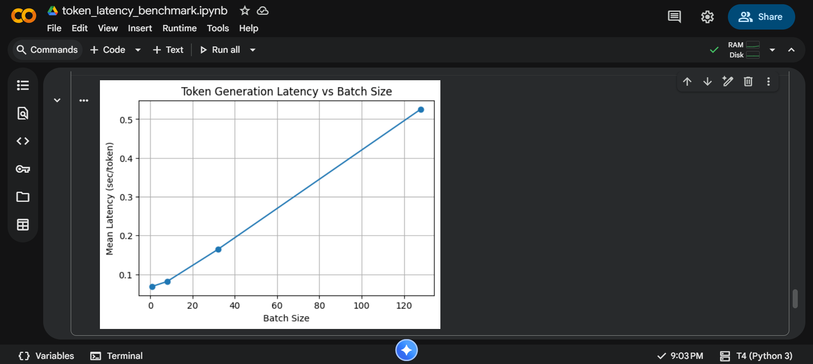

# LLaMA Token Generation Latency Benchmark

This project benchmarks **token generation latency** and **throughput** of a language model using different batch sizes.

The experiment was executed on **Google Colab (Tesla T4 GPU)** using the fallback model **GPT-Neo 1.3B**, because LLaMA requires gated access.

---

##  Project Structure

project-folder/
│
├── README.md
├── token_latency_benchmark.ipynb     # Main Colab notebook
│
└── results/
      └── llama_benchmark_results.csv # Benchmark output

---

## Results Summary

| Batch Size | Mean Latency (s/token) | Throughput (tokens/s) |
|-----------|-------------------------|------------------------|
| 1   | 0.0687 | 14.86 |
| 8   | 0.0812 | 100.26 |
| 32  | 0.1640 | 195.56 |
| 128 | 0.5256 | 243.70 |

Latency increases when batch size grows,  
while throughput becomes much higher for bigger batches.

---

---
##  Benchmark Graph

## 🛠 Requirements

- Python 3.10+
- PyTorch (GPU)
- Transformers
- Pandas
- Numpy
- Matplotlib

---

## 📥 Output File

Results saved in: results/llama_benchmark_results.csv

## Author

**Pawan Dubey**  
Token Generation Latency Benchmark (Python Project)
